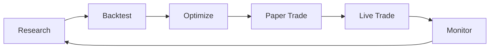

# Guides

In-depth guides for using dgbit effectively.

## Available Guides

-   :material-chart-line:{ .lg .middle } **Trading Strategies**

    ---

    Learn how to use dgbit's built-in trading strategies

    [:octicons-arrow-right-24: Strategies Guide](strategies.md)

-   :material-flask:{ .lg .middle } **Backtesting**

    ---

    Test strategies with historical data and analyze performance

    [:octicons-arrow-right-24: Backtesting Guide](backtesting.md)

-   :material-play-circle:{ .lg .middle } **Live Trading**

    ---

    Execute trades on Bybit with real or testnet funds

    [:octicons-arrow-right-24: Live Trading Guide](live-trading.md)

-   :material-code-braces:{ .lg .middle } **Custom Strategies**

    ---

    Build your own trading strategies with dgbit

    [:octicons-arrow-right-24: Custom Strategies](custom-strategies.md)

## Workflow Overview

1. **Research**: Develop trading ideas and hypotheses
2. **Backtest**: Test strategies against historical data
3. **Optimize**: Tune parameters for better performance
4. **Paper Trade**: Test with testnet funds
5. **Live Trade**: Deploy with real capital
6. **Monitor**: Track performance and refine

## Best Practices

### Start Small
- Begin with testnet and small position sizes
- Validate strategies thoroughly before scaling

### Risk Management
- Always use stop-losses
- Limit position sizes relative to capital
- Diversify across multiple strategies/assets

### Continuous Improvement
- Monitor strategy performance regularly
- Adapt to changing market conditions
- Keep detailed trading logs
